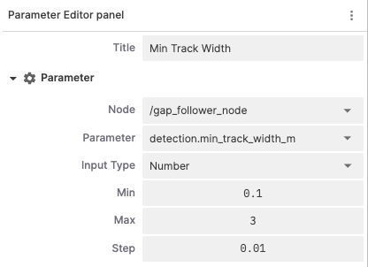
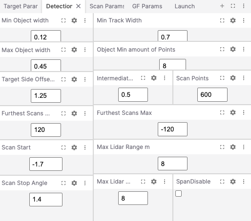

# 🦊 Foxglove Parameter Editor

An extension for Foxglove for conveniently viewing and adjusting paramameters of different types.

## Features

- **Improved Performance**: Utilizes the existing Foxglove bridge instead of requiring an additional rosbridge server, reducing overall resource usage.
- **Persistent Selections**: Unlike the native parameter editor, your previously selected node and parameter persist between panel openings, eliminating the need to reselect each time.
- **Flexible Layout**: Supports multiple panels that can be arranged according to your workflow needs.
- **Real-time Updates**: Parameter changes take effect immediately, allowing for quick testing and configuration.
- **User-Friendly**: Adjust parameters with UI components such as sliders, checkboxes, and numeric inputs, making it easy to work with different parameter types.

## Installation

1. Clone this repository to your local machine.
2. Navigate to the project directory.

**Important**: For parameter adjustments to work properly, the target ROS nodes must have parameter change callbacks implemented. Without these callbacks, the nodes will not respond to parameter updates sent by this extension. [See the docs](https://docs.ros.org/en/rolling/Tutorials/Intermediate/Monitoring-For-Parameter-Changes-CPP.html) for more information on how to implement parameter change callbacks in your ROS nodes.

## Usage

Select the node you want to edit parameters for in the top left dropdown, then select the parameter you want to edit in the second dropdown. The third dropdown will show the type of the parameter, and the input field will allow you to change the value of the parameter. The value will be set on change.

<div style="text-align: center;">
    
    
</div>

The panel can be arranged however you like, and you can use multiple panels together for improved workflow.

## Development

### Compile from source

`npm install` to install dependencies
`npm run local-install` to build and install for a local copy of the Foxglove Studio Desktop App
`npm run package` to package it up into a .foxe file

[Foxglove](https://foxglove.dev) allows developers to create [extensions](https://docs.foxglove.dev/docs/visualization/extensions/introduction), or custom code that is loaded and executed inside the Foxglove application. This can be used to add custom panels. Extensions are authored in TypeScript using the `@foxglove/extension` SDK.

### Develop

Extension development uses the `npm` package manager to install development dependencies and run build scripts.

To install extension dependencies, run `npm` from the root of the extension package.

```sh
npm install
```

To build and install the extension into your local Foxglove desktop app, run:

```sh
npm run local-install
```

Open the Foxglove desktop (or `ctrl-R` to refresh if it is already open). Your extension is installed and available within the app.

### Package

Extensions are packaged into `.foxe` files. These files contain the metadata (package.json) and the build code for the extension.

Before packaging, make sure to set `name`, `publisher`, `version`, and `description` fields in _package.json_. When ready to distribute the extension, run:

```sh
npm run package
```

This command will package the extension into a `.foxe` file in the local directory.

### Publish

You can publish the extension to the public registry or privately for your organization.

See documentation here: https://docs.foxglove.dev/docs/visualization/extensions/publish/#packaging-your-extension

## Todo
- [ ] Add support for text parameters
- [ ] Add support for array parameters

## Inspirations

This project took ideas and inspiration and improved upon the following sources:

- https://github.com/danclapp4/ros2-parameter-extension
- https://github.com/nobleo/ros2-parameter-extension
- https://github.com/ZealousGinger/foxglove-parameter-slider

## Other resources 

- https://docs.foxglove.dev/extension-api/type-aliases/ExtensionPanelRegistration